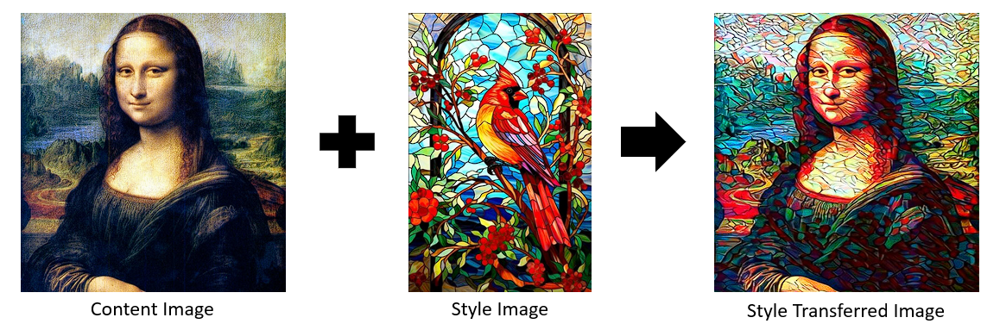

# Neural Style Transfer Web Application



## Overview

This web application provides an intuitive interface for applying Neural Style Transfer, an AI technique that composes images in the style of another image. The system allows users to upload content and style images, customize parameters, and download the stylized results.

The application consists of two main components:
- A FastAPI backend that handles the neural style transfer processing using PyTorch and VGG19
- A Flask frontend that provides a user-friendly web interface

## Features

- Upload content and style images
- Customize style transfer parameters:
  - Content/style weights
  - Number of optimization steps
  - Learning rate
  - Layer-specific style weights
- Real-time progress tracking
- Preview and download stylized images
- Responsive web interface

## Technical Implementation

### Architecture
- **Backend**: FastAPI with PyTorch for neural style transfer
- **Frontend**: Flask web application with responsive design
- **Communication**: REST API between frontend and backend

### Neural Style Transfer Algorithm
The application uses the VGG19 convolutional neural network pre-trained on ImageNet to extract features from content and style images. It then optimizes an output image to match the content features of the content image and the style features (computed using Gram matrices) of the style image.

## Installation

### Prerequisites
- Python 3.7 or higher
- PyTorch 1.7 or higher
- CUDA-capable GPU recommended (but not required)

### Setup

1. Clone the repository:
```bash
git clone https://github.com/THAMIZH-ARASU/Neural-Style-Transfer-Using-VGG19.git
cd Neural-Style-Transfer-Using-VGG19
```

2. Create and activate a virtual environment:
```bash
python3 -m venv venv
source venv/bin/activate  # On Windows, use: venv\Scripts\activate
```

3. Install dependencies:
```bash
pip3 install -r requirements.txt
```

4. Set up environment variables (optional):
```bash
# For Linux/macOS
export API_URL=http://localhost:8000

# For Windows
set API_URL=http://localhost:8000
```

## Usage

### Starting the Application

1. Start the backend service:
```bash
cd app/backend
uvicorn main:app --host 0.0.0.0 --port 8000
```

2. In a separate terminal, start the frontend service:
```bash
cd app/frontend
python3 app.py
```

3. Open your web browser and navigate to:
```
http://localhost:5000
```

### Using the Application

1. **Upload Images**:
   - Click on the upload buttons to select your content and style images
   - Both images should be in JPG or PNG format

2. **Configure Parameters**:
   - Adjust the content and style weights to control the balance between preserving content and applying style
   - Increase or decrease the number of steps to control processing time and result quality
   - Fine-tune layer-specific weights to influence how the style is applied

3. **Process**:
   - Click the "Transfer Style" button to begin processing
   - The progress will be displayed in real-time

4. **Download**:
   - Once processing is complete, preview the result and download the stylized image

## Parameter Guide

- **Content Weight**: Higher values preserve more of the original content structure (default: 1.0)
- **Style Weight**: Higher values apply more of the style characteristics (default: 1e6)
- **Steps**: More steps generally produce better results but take longer to process (default: 300)
- **Learning Rate**: Controls how quickly the optimization progresses (default: 0.003)
- **Layer Weights**:
  - conv1_1: Influences fine texture details
  - conv2_1: Affects smaller features
  - conv3_1: Controls medium-scale features
  - conv4_1: Influences larger patterns
  - conv5_1: Affects overall structure

## Troubleshooting

- **"GPU not available" message**: The application will run on CPU, which is slower but still functional. For faster processing, use a CUDA-capable GPU.
- **Memory errors**: Reduce image size or decrease batch size if encountering memory issues.
- **Processing appears stuck**: For complex images or high step counts, processing can take time. Check API health endpoint for status.

## Project Structure

```
Neural-Style-Transfer-Using-VGG19/
├── app/
│   ├── backend/
│   │   └── main.py        # FastAPI backend with neural style transfer logic
│   └── frontend/
│       ├── app.py         # Flask frontend application
│       ├── static/        # Static files (CSS, JS, images)
│       └── templates/     # HTML templates
├── requirements.txt       # Project dependencies
└── README.md              # This file
```

## Development

### API Endpoints

- `POST /upload/`: Upload content and style images
- `POST /transfer/`: Perform neural style transfer
- `GET /download/{result_id}`: Download the resulting image
- `GET /health`: Check API health status

### Adding Custom Styles

The application can be extended with preset styles by:
1. Adding style images to a "presets" folder
2. Modifying the frontend to offer these as quick selections

## License

This project is licensed under the MIT License - see the LICENSE file for details.

## Acknowledgments

- Neural Style Transfer is based on the paper ["A Neural Algorithm of Artistic Style"](http://arxiv.org/pdf/1508.06576) by Gatys et al.
- The implementation uses the VGG19 model architecture pre-trained on ImageNet.
